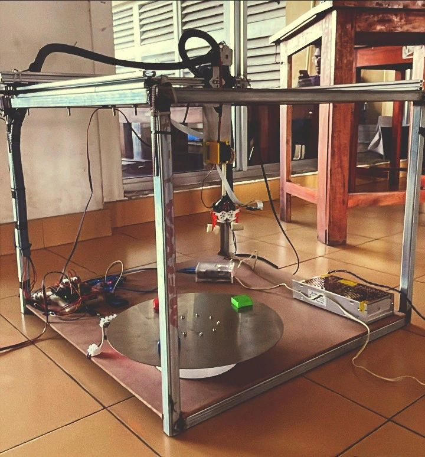
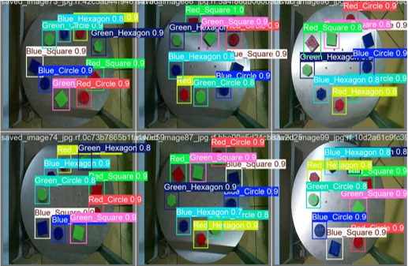

# Vision-Guided Cartesian Pick-and-Place Robot

A Raspberry Pi-based Cartesian (gantry) robot that detects objects using computer vision, computes their position, and autonomously picks and places them using stepper-motor-driven axes.

---

## 📌 Overview

This project combines **mechanical design**, **computer vision**, **embedded motor control** and a **web-based interface** into a single automated pick-and-place system. A camera mounted above the workspace captures the scene; a YOLOv8 + OpenCV pipeline detects and localizes target objects; the coordinates are transformed into robot-space commands; and stepper motors drive the X, Y and Z axes to pick and place the object.

The goal was to build a complete mechatronic system — not just a vision demo or a motor demo — and to integrate all subsystems into a working robot.

---

## 🎯 Objectives

- Design and fabricate a rigid Cartesian (gantry) frame with three axes of motion.
- Implement real-time object detection and localization using YOLOv8 and OpenCV.
- Convert camera pixel coordinates into robot workspace coordinates.
- Drive three stepper motors precisely using A4988 drivers.
- Provide a simple web interface for monitoring and manual control.
- Integrate vision, motion control and the user interface into one system.

---

## 🧠 System Architecture

Camera → Raspberry Pi (YOLOv8 + OpenCV) → Arduino → A4988 drivers → Steppers → End effector

More detail will be added in `docs/architecture.md`.

---

## 🛠️ Hardware

| Component | Purpose |
|---|---|
| Raspberry Pi | Vision processing, high-level control |
| Arduino (Uno) | Real-time stepper control |
| A4988 stepper drivers × 2 | Drive X, Y |
| NEMA 17 stepper motors × 2 | Axis motion |
| Pi Camera / USB camera | Object detection |
| 12V PSU | Motor power |
| Linear rails, belts, bearings | Mechanical motion |
| End effector (gripper) | Pick and place |

---

## 💻 Software

### Vision (`src/vision/`)
- YOLOv8 model for object detection
- OpenCV for frame capture, filtering and coordinate extraction
- Pixel → robot coordinate transform

### Control (`src/control/`)
- Arduino firmware for stepper motion
- Serial command protocol from Raspberry Pi → Arduino
- Homing, jogging and pick-place routines

### Communication (`src/communication/`)
- Serial link between Pi and Arduino
- Web interface for monitoring and manual control

---

## 🧠 Vision Model

Custom-trained **YOLOv8** model detecting **9 object classes**:

- **Shapes:** square, circle, hexagon
- **Colors:** red, green, blue
- **Total combinations:** 3 × 3 = 9 classes

Full details in [`src/vision/README.md`](src/vision/README.md).

📦 **Trained weights:** *(available on request — will be attached as a GitHub Release)*

## 🚀 Getting Started

Instructions for the Raspberry Pi pipeline and Arduino firmware are in [`docs/`](docs/).

### Note on the vision model
The YOLOv8 detection pipeline is described in [`src/vision/`](src/vision/) and the coordinate-transform logic is documented in [`docs/architecture.md`](docs/architecture.md). The trained `.pt` weights are **not committed to this repository** — they will be retrained and re-added (see Roadmap). Anyone cloning this repo should train their own model on the target objects, or swap in a pretrained YOLOv8 checkpoint from Ultralytics as a starting point.

---

## 📁 Repository Structure

vision-guided-cartesian-robot/
├── README.md
├── docs/ # architecture, wiring, BOM
├── src/
│ ├── vision/ # YOLOv8 + OpenCV pipeline
│ ├── control/ # Arduino firmware + motion
│ └── communication/
├── cad/ # SolidWorks / STEP files
└── images/ # photos, screenshots, diagrams

## 📷 Media

### 🎬 Demo video

▶️ **[Watch the robot pick and place objects](https://github.com/induwarawijesinghe369-bit/vision-guided-cartesian-robot/releases/download/v1.0-demo/WhatsApp.Video.2026-09-14.at.7.50.41.AM.mp4)**

### Assembled robot

### Vision system in action

*YOLOv8 detecting the 9 target objects (square / circle / hexagon × red / green / blue).*

---

## 🗺️ Roadmap

## 🗺️ Roadmap

- [x] Mechanical frame design and fabrication
- [x] Stepper motor control via A4988
- [x] YOLOv8 detection pipeline (initial version)
- [x] Coordinate mapping pixel → robot space
- [x] Serial communication Pi ↔ Arduino
- [x] Web interface
- [ ] Retrain YOLOv8 model on current target objects and commit weights
- [ ] Full closed-loop pick-and-place demo
- [ ] Gripper upgrade
- [ ] Demo video
---

## 👤 Author

**Induwara Wijesinghe**  
Mechanical Engineering Undergraduate — Mechatronics  
University of Moratuwa  
📧 induwarawijesinghe369@gmail.com
